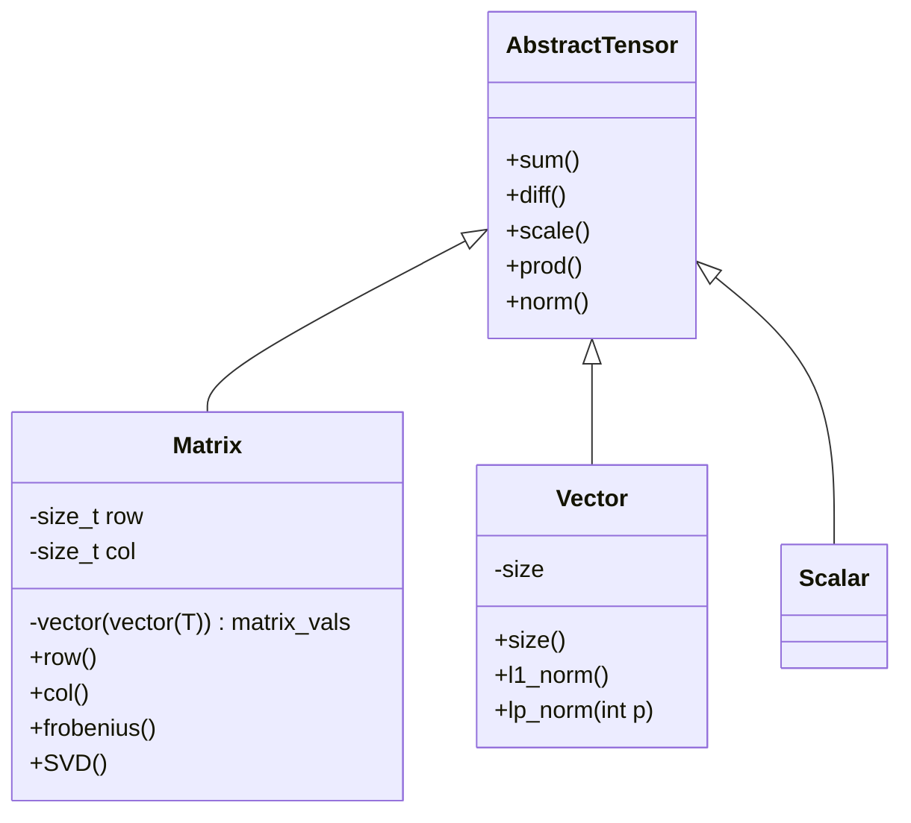

# Use 
To use and test any of the heavily WIP methods, simply execute from the root directory:
``` 
    bash MatrixOps/scripts/build.sh
```

And then to execute the code without any parameters (parameters are WIP):

```
    bash MatrixOps/scripts/exec.sh 
```

# Current Plans 

Implement AbstractTensor class as such 



# Motivation

I wanted to provide an implementation of a lot of the algorithms I saw in my NLA course for fun with numpy. I hope to go further with a lot of the code here and potentially extend it to some lower level code I can put in a python wrapper. I included some TeX notes with everything as well since 
